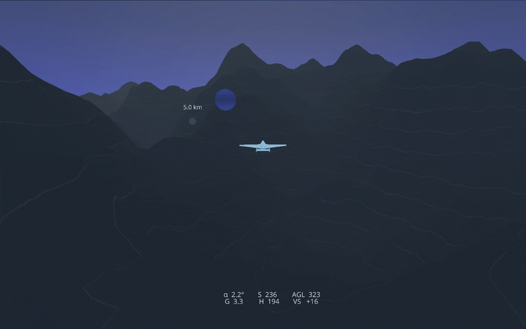
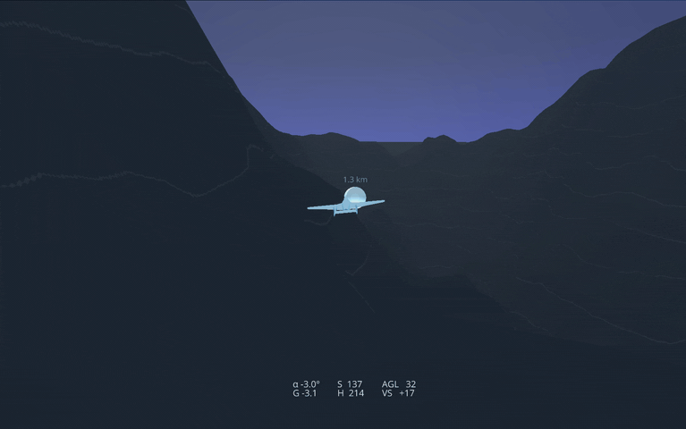
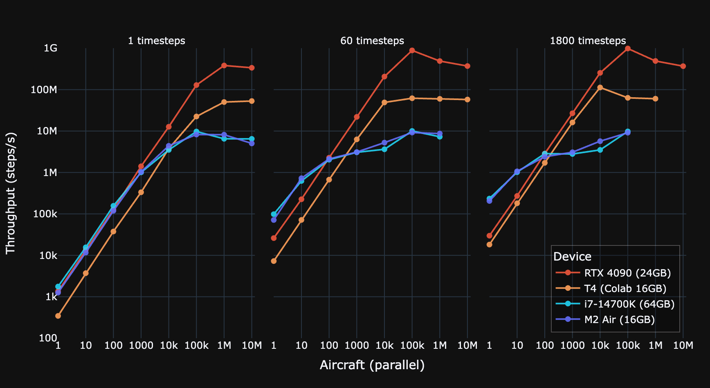

<div align="center">

  <h1>🌩️ Nimbus</h1>
  
  <h3>A massively parallelisable JAX flight simulation</h3>
  
  [](https://www.python.org/)
  [](https://github.com/google/jax)
  [](https://github.com/astral-sh/ruff)
  [](https://opensource.org/licenses/Apache-2.0)
  [](https://colab.research.google.com/github/auxeno/nimbus/blob/main/notebooks/nimbus-demo.ipynb)

</div>

---

<div align="center">
    <h3>
      <a href="#overview">Overview</a> |
      <a href="#features">Features</a> |
      <a href="#installation">Installation</a> |
      <a href="#quick-start">Quick Start</a> |
      <a href="#demo">Demo</a> |
      <a href="#project-structure">Project Structure</a>
    </h3>
</div>

---

## Overview

Nimbus is a high-performance flight simulation framework built on JAX, designed for massive parallelisation and differentiability. Leveraging JAX's JIT compilation and automatic differentiation, Nimbus enables researchers and engineers to simulate millions of aircraft simultaneously on modern hardware accelerators.

Whether you're conducting aerodynamics research, exploring control algorithms, or studying flight dynamics, Nimbus provides a fast, scalable, and fully differentiable simulation environment.

<div align="center">
  
  
  
</div>

## Features

- ⚡ **Massive Parallelisation**: Simulate millions of aircraft simultaneously on modern GPUs
- 🎮 **6DOF Flight Model**: Full six degrees of freedom rigid body dynamics
- 🔄 **Quaternion Rotation Engine**: Singularity-free 3D rotations
- 🎯 **RK4 Physics Integrator**: Fourth-order Runge-Kutta for high numerical accuracy
- 🏔️ **Layered Simplex Noise Terrain**: Procedurally generated terrain with realistic features
- 🌬️ **Atmospheric Modeling**: Exponential atmosphere model with stochastic wind gusts
- 🛡️ **G-Limiter**: PID G-force limiting
- 🎮 **3D Visualisation**: Real-time rendering with Ursina engine

## Installation

```bash
# Basic installation
pip install git+https://github.com/auxeno/nimbus

# With visualisation support (includes Ursina and Pillow)
pip install "nimbus[viz] @ git+https://github.com/auxeno/nimbus"
```

For local development:
```bash
git clone https://github.com/auxeno/nimbus.git
cd nimbus
pip install -e .         # basic installation
pip install -e ".[viz]"  # with visualisation
```

For GPU acceleration (requires compatible OS and GPU):
```bash
pip install --upgrade "jax[cuda12]"
```

## Quick Start

```python
import jax
from nimbus import quick_scenario, step, SimulationConfig

# Generate a complete scenario with terrain and waypoints
simulation, heightmap, route = quick_scenario(seed=42)

# Single simulation step
key = jax.random.PRNGKey(0)
config = SimulationConfig()
next_sim, next_route = step(key, simulation, heightmap, route, config)

# Parallel simulation of 1000 aircraft
from nimbus import generate_simulation, InitialConditions

keys = jax.random.split(key, 1000)
simulations = jax.vmap(generate_simulation, in_axes=(0, None))(
    keys, InitialConditions.default()
)
routes = jax.vmap(lambda _: route)(keys)  # same route for all
step_batch = jax.vmap(step, in_axes=(0, 0, None, 0, None))
next_sims, next_routes = step_batch(keys, simulations, heightmap, routes, config)
```

## Demo

For a demonstration of Nimbus capabilities, check out the Nimbus demo notebook:

[](https://colab.research.google.com/github/auxeno/nimbus/blob/main/notebooks/nimbus-demo.ipynb)

The notebook demonstrates:
- Simulating 1 million aircraft in parallel
- Extended temporal simulations
- Interactive 3D scenario visualisation with Plotly
- Custom scenario generation
- Terrain and aircraft configuration

### 3D Visualisation

For real-time 3D visualisation with the Ursina engine (requires local installation):

| Key | Action |
|-----|--------|
| **W** | Pitch down (nose down) |
| **S** | Pitch up (nose up) |
| **A** | Yaw left |
| **D** | Yaw right |
| **Q** | Roll left |
| **E** | Roll right |
| **P** | Pause/unpause simulation |
| **Scroll** | Zoom camera in/out |

## Project Structure

```
nimbus/
├── core/
│   ├── config.py       # simulation configuration dataclasses
│   ├── interface.py    # high-level physics interface
│   ├── logic.py        # control logic (PID controllers)
│   ├── physics.py      # aerodynamic forces and moments
│   ├── primitives.py   # type definitions
│   ├── quaternion.py   # 3D rotation operations
│   ├── scenario.py     # scenario management
│   ├── simulation.py   # numerical integration (RK4/Euler)
│   ├── spatial.py      # spatial operations and collision
│   ├── state.py        # aircraft and simulation state
│   ├── terrain.py      # procedural terrain generation
│   └── wind.py         # wind and turbulence modeling
└── visual/
    ├── config.py       # visualisation configuration
    ├── entities.py     # 3D entities (aircraft, terrain)
    ├── runtime.py      # Ursina runtime
    └── utils.py        # visualisation utilities
```

## Benchmarks

<div align="center">
  
</div>

### Benchmark Methodology

The code used for benchmarking can be found at the end of the demo notebook for easy results replication. Each data point is the average of 10 runs.

### Hardware Configurations

| Hardware | Type | Memory | Max Throughput | Sim Time Ratio |
|----------|------|--------|----------------|----------------|
| Apple M2 Air @ 3.5GHz | CPU | 16 GB | 9.2M steps/second | 1.8 days/second |
| i7 14770k @ 5.6GHz | CPU | 64 GB | 10.0M steps/second | 1.9 days/second |
| Google Colab T4 | GPU | 16 GB VRAM | 112M steps/second | 22 days/second |
| NVIDIA RTX 4090 | GPU | 24 GB VRAM | 983M steps/second | 190 days/second |

*Max Throughput: Peak aircraft-steps per second | Sim Time Ratio: Simulated seconds per wall-clock second*

## Citation

If you use Nimbus in your research, please cite:

```bibtex
@software{nimbus2024,
  title = {Nimbus: A Massively Parallelisable JAX Flight Simulation},
  author = {Alex Goddard},
  year = {2024},
  url = {https://github.com/auxeno/nimbus}
}
```

## License

Apache 2.0 - See [licence](licence) for details.

## Acknowledgments

Built with [JAX](https://github.com/google/jax) • Visualised with [Ursina](https://github.com/pokepetter/ursina)