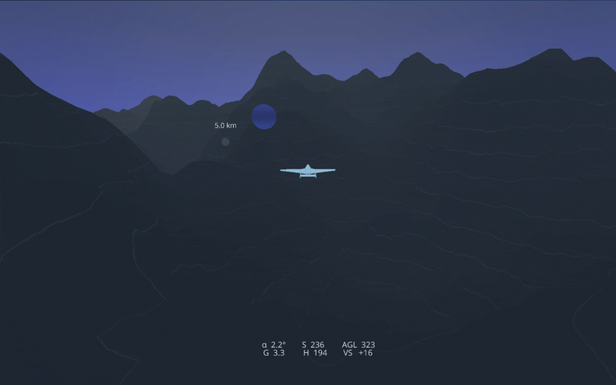

<div align="center">

  <h1>🌩️ Nimbus</h1>
  
  <h3>A massively parallelisable JAX flight simulation</h3>
  
  [](https://www.python.org/)
  [](https://github.com/google/jax)
  [](https://github.com/astral-sh/ruff)
  [](https://opensource.org/licenses/Apache-2.0)

</div>

---

<div align="center">
    <h3>
      <a href="#overview">Overview</a> |
      <a href="#features">Features</a> |
      <a href="#installation">Installation</a> |
      <a href="#quick-start">Quick Start</a> |
      <a href="#demo">Demo</a> |
      <a href="#architecture">Architecture</a>
    </h3>
</div>

---

## Overview

Nimbus is a high-performance flight simulation framework built on JAX, designed for massive parallelisation and differentiability. Leveraging JAX's JIT compilation and automatic differentiation, Nimbus enables researchers and engineers to simulate millions of aircraft simultaneously on modern hardware accelerators.

Whether you're conducting aerodynamics research, exploring control algorithms, or studying flight dynamics, Nimbus provides a fast, scalable, and fully differentiable simulation environment.

<div align="center">
  
  
  
</div>

## Features

- ⚡ **Massive Parallelisation**: Simulate up to *20 million* aircraft on consumer hardware (RTX 4090)
- 🎮 **6DOF Flight Model**: Full six degrees of freedom rigid body dynamics
- 🔄 **Quaternion Rotation Engine**: Singularity-free 3D rotations
- 🎯 **RK4 Physics Integrator**: Fourth-order Runge-Kutta for high numerical accuracy
- 🏔️ **Layered Simplex Noise Terrain**: Procedurally generated terrain with realistic features
- 🌬️ **Atmospheric Modeling**: Simple exponential atmosphere model with stochastic wind gusts
- 🛡️ **G-Limiter**: PID G-force limiting
- 🐻 **3D Visualisation**: Real-time rendering with Ursina engine

## Installation

```bash
# Basic installation
pip install git+https://github.com/auxeno/nimbus.git

# With visualisation support (includes Ursina and Pillow)
pip install "nimbus[viz] @ git+https://github.com/auxeno/nimbus.git"
```

For local development:
```bash
git clone https://github.com/auxeno/nimbus.git
cd nimbus
pip install -e .         # basic installation
pip install -e ".[viz]"  # with visualisation
```

For GPU acceleration (requires compatible OS and GPU):
```bash
pip install --upgrade "jax[cuda12]"
```

## Quick Start

```python
import jax
import nimbus

# Create simulation configuration
config = ...

sim = ...

# Parallel simulation of multiple aircraft
aircraft_batch = jax.vmap(nimbus.step)...
```

## Demo

For a comprehensive demonstration of Nimbus capabilities, check out the demo notebook:

[](https://colab.research.google.com/github/auxeno/nimbus/blob/main/notebooks/nimbus-demo.ipynb)

### Ursina Visualisation Controls

When running the 3D visualisation environment:

| Key | Action |
|-----|--------|
| **W** | Pitch down (nose down) |
| **S** | Pitch up (nose up) |
| **A** | Yaw left |
| **D** | Yaw right |
| **Q** | Roll left |
| **E** | Roll right |
| **P** | Pause/unpause simulation |
| **Scroll** | Zoom in/out |

## Architecture

### Project Structure

```
nimbus/
├── core/
│   ├── config.py       # simulation configuration dataclasses
│   ├── interface.py    # high-level physics interface
│   ├── logic.py        # control logic (PID controllers)
│   ├── physics.py      # aerodynamic forces and moments
│   ├── primitives.py   # type definitions
│   ├── quaternion.py   # 3D rotation operations
│   ├── scenario.py     # scenario management
│   ├── simulation.py   # numerical integration (RK4/Euler)
│   ├── spatial.py      # spatial operations and collision
│   ├── state.py        # aircraft and simulation state
│   ├── terrain.py      # procedural terrain generation
│   └── wind.py         # wind and turbulence modeling
└── visual/
    ├── config.py       # visualisation configuration
    ├── entities.py     # 3D entities (aircraft, terrain)
    ├── runtime.py      # Ursina runtime
    └── utils.py        # visualisation utilities
```

### Key Design Principles

1. **Pure Functions**: All physics computations are pure JAX functions
2. **Vectorisation**: Native support for batched operations via `jax.vmap`
3. **Differentiability**: Fully differentiable dynamics for gradient-based optimisation
4. **JIT Compilation**: Automatic XLA compilation for maximum performance
5. **Frames of Reference**: Standard aerospace/simulation reference frames: North East Down world-frame (flat earth) and Forward Right Down body-frame.

## Benchmarks

Performance on various hardware:

| Hardware | Single Aircraft | Batch Size | Steps/Second |
|----------|----------------|------------|--------------|
| CPU (M2 Air) | 1 | 1,000 | ~100K |
| RTX 4090 | 1 | 1,000,000 | ~10K |

*Benchmark conditions: 6DOF dynamics, RK4 integration, terrain collision*

## Citation

If you use Nimbus in your research, please cite:

```bibtex
@software{nimbus2024,
  title = {Nimbus: A Massively Parallelisable JAX Flight Simulation},
  author = {Alex Goddard},
  year = {2024},
  url = {https://github.com/auxeno/nimbus}
}
```

## License

Apache 2.0 - See [licence](licence) for details.

## Acknowledgments

Built with [JAX](https://github.com/google/jax) • Visualised with [Ursina](https://github.com/pokepetter/ursina)